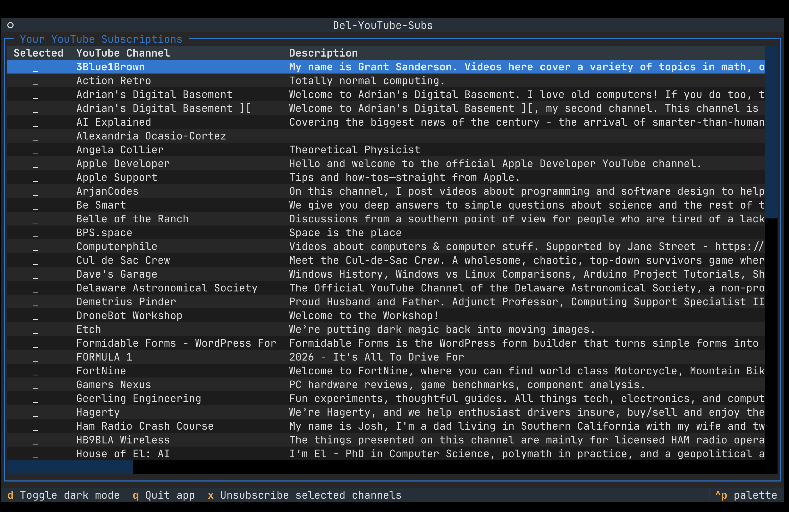
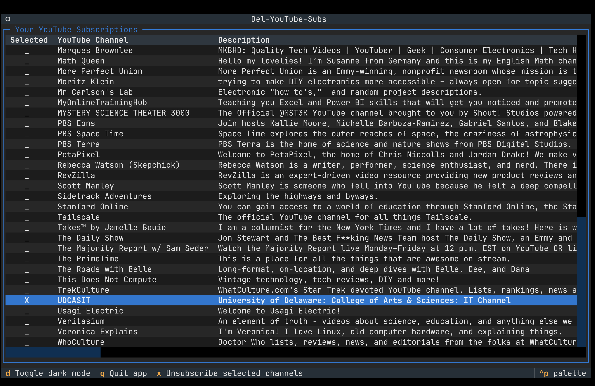
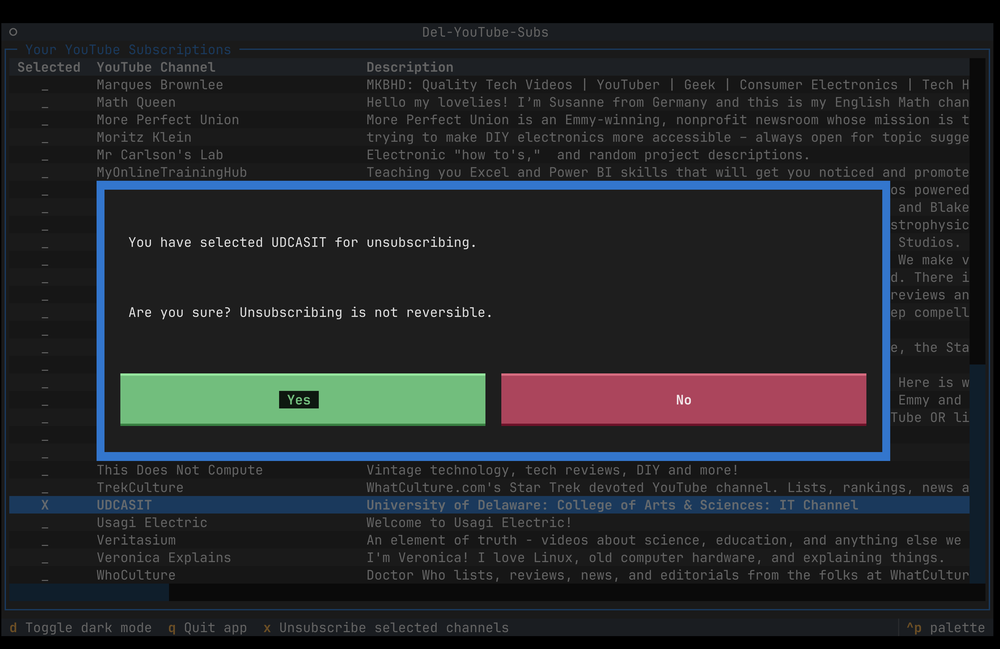
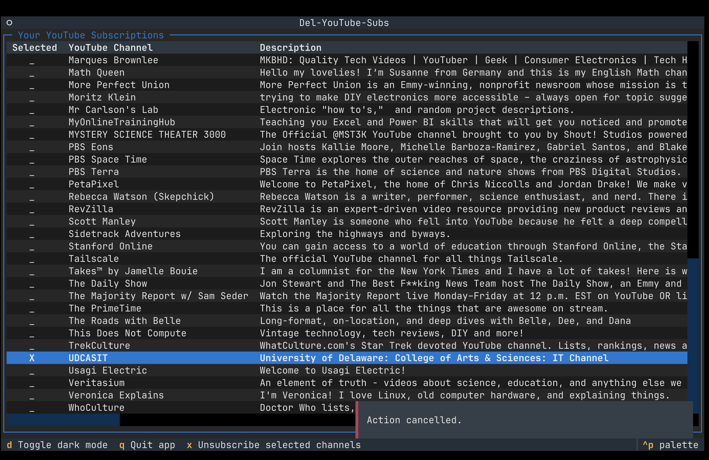

# Del-Y-Subs

A python app with TUI for batch deleting YouTube subscriptions.

## Motivation

I accumulate YouTube channels because I watch a few videos that I like from a channel and then feel compelled to hit the "subscribe" button.  After a while, I lose interest, but I forget to unsubscribe.  The YouTube web GUI does not have a way to select multiple subscribed channels for unsubscribing, and it is annoying to unsubscribe one-by-one.  I realize this is probably to discourage unsubscribing, but if you have hundreds of subsciptions, removing a bunch at one time becomes helpful to keep things sane.

This app's only function is to list all of the channels to which one is subscribed and allow for marking multiple channels for unsubscribing.  It is a TUI app, so it runs well on all the major OSes in their CLI interfaces.

## Goals

* Submit this app repository for the [Boot.dev](https://boot.dev) "Capstone Project" portfolio project
* Develop small, complete app that accomplishes a well-defined function
* Learn the Textual TUI app framework for Python
* Learn to use the YouTube Data API (v3) to gather subscription information and to delete subscriptions

## How to setup and run this application

### Prerequisites

* A YouTube account with subscribed channels from which you would like to unsubscribe
* YouTube API credentials (see https://developers.google.com/youtube/v3/getting-started for details)
* The UV Python package and project manager (https://github.com/astral-sh/uv) installed on your computer

### Quick Start

1. Clone repo
1. Put your YouTube API token info in the client_secrets.json file in the root of the cloned repo.
1. Use UV to synchronize the packages.
    ```
    uv sync
    ```
1. Run the app.
    ```
    uv run del-y-subs
    ```
   1.  On first run, you will be directed to log into your YouTube account in your default web browser.

## Usage

1. When you run the app and successfully log into your YouTube account, the entire list of all the channels to which you are subscribed will appear.*Del-Y-Subs main screen showing list of subscribed YouTube channels*
1. Press the 'q' key to quit the app.  The up and down arrow keys (as well as the pg up & pg down) work to move the cursor bar up and down through the list.  Pressing the Enter key, toggles selecting the channel that the cursor bar is on.  When all the desired channels are selected, press the 'x' key to unsubscribe from the selected channels.*Del-Y-Subs screen showing a selected channel*
1. After pressing the 'x' key to trigger the deletion of the selected channels, a confirmation dialog box appears.*Del-Y-Subs screen showing confirmation modal dialog box*
The Tab key is used to move the selector between the Yes and No buttons. Press Enter to choose the selected choice.
1. If the No button is chosen, a brief notification that the unsubsciption was aborted is displayed.*A notification that the unsubscription was aborted is displayed when No is chosen in the confirmation dialog*

### Mouse input
When the terminal app used to run Del-Y-Subs is running on a GUI, like macOS, Windows or Linux, the mouse input works on buttons in the TUI of Del-Y-Subs. For example, when the confirmation dialog appears before deleting selected subscriptions, the mouse can be used to choose the Yes and No buttons.

*NOTE: No mouse input is passed through when the app is run inside a remote SSH session.*

## Contributing

To contribute to this project please follow these steps:

### 1. Make sure you meet the [prerequisites](#prerequisites)
### 2. Clone the repo
```
% git clone https://github.com/PetShwark/del-y-subs
% cd del-y-subs
```
### 3. Prepare, run and test the project
```
% uv sync
% uv run del-y-subs
```
### 4. Submit a pull request 
For any proposed fixes or improvements please submit a pull request on the 'main' branch.